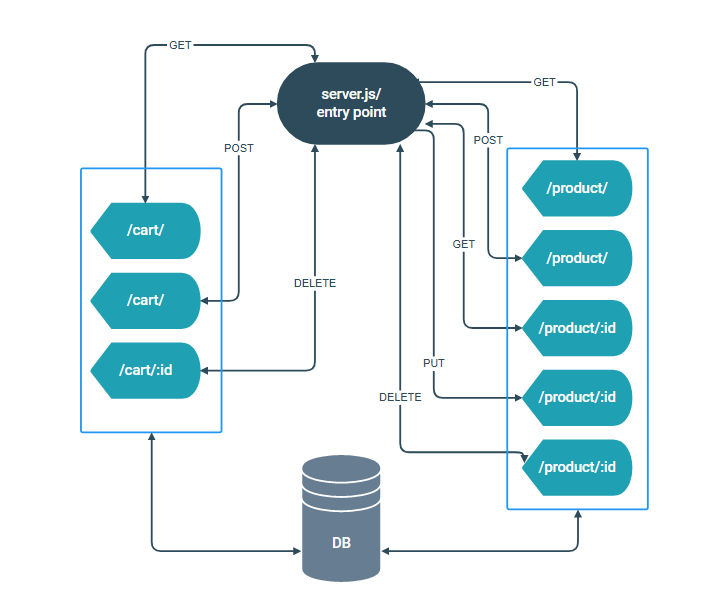

## MrsCart

it a store application

## Author: Faten Samman

## Version: 1.0.0

## Documentation

## Setup

1. Clone the repository
2. run this line of code `npm i` to install all dependencies
3. create .env file and write these secret variables:
   - PORT=3330
   - DB_HOST=localhost
   - DB_USER=root
   - DB_PASS=0000
   - DB_NAME=store
